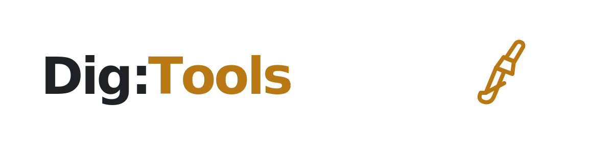
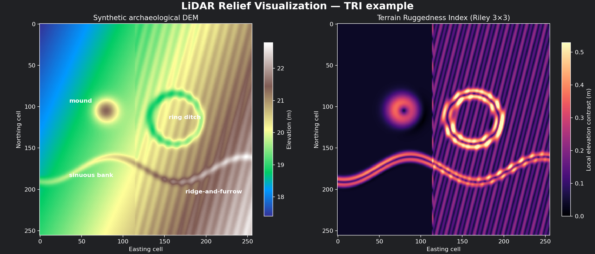

  

# LiDAR Relief Visualization Plugin — v2.0

A QGIS Processing plugin for advanced archaeological terrain visualization from
Digital Elevation Models (DEMs). Provides **29 algorithms** covering LiDAR
relief visualization, multi-temporal change detection, multi-sensor fusion,
AI feature detection, point cloud ground filtering, and export/publishing —
all within QGIS. Core terrain tools have no dependencies beyond QGIS's bundled
libraries; specialized capabilities clearly identify their optional packages.

*A reproducible synthetic example showing how TRI responds to a mound, ring
ditch, sinuous bank, and ridge-and-furrow. It is a visual aid, not an
archaeological classification.*

## Quick start

1. Install **LiDAR Relief Visualization** from QGIS Plugin Manager.
2. Load a projected DEM whose horizontal and vertical units are metres.
3. Open **Processing Toolbox → LiDAR Relief**.
4. Start with **Batch Relief Visualisation** and the closest landscape preset,
   or run **Terrain Ruggedness Index (TRI)** for local elevation contrast.
5. Compare multiple visualizations and validate potential features against
   complementary evidence before interpretation.

## Features

### Terrain Visualization and Analysis

The plugin integrates directly into the QGIS Processing Toolbox and provides
the following terrain visualization algorithms:

- **Multi-directional Hillshade**: Blends multiple illumination angles to
  eliminate the directional bias of traditional single-light-source hillshades.
- **RVT Multi-directional Hillshade**: Reference implementation from the
  rvt-py (Relief Visualization Toolbox) package. Useful for cross-validating
  results against any other RVT installation (QGIS, R, standalone).
- **Simple Local Relief Model (SLRM)**: Removes macro-topography to isolate
  micro-relief features like ancient ditches, walls, and mounds.
- **Sky-View Factor (SVF)**: Computes the proportion of the sky visible from
  each pixel. Concave features (pits, ditches) appear dark, convex features
  (ridges, mounds) appear bright. Includes 1D look-ahead noise filter.
- **Anisotropic Sky-View Factor (ASVF)**: Directionally weighted SVF for
  simulating anisotropic lighting conditions.
- **Topographic Openness (Positive/Negative)**: Highlights ridges/crests
  (positive) or valleys/pits (negative).
- **RVT Topographic Openness**: Reference implementation from the `rvt-py`
  Relief Visualization Toolbox, exposing the same Positive/Negative modes,
  search directions, and search radius as the native implementation for
  cross-validation against other RVT installations.
- **Local Dominance**: Horizon-scanning ray trace identifying locally dominant
  or dominated pixels.
- **Multi-Scale Topographic Position (MSTP)**: DEV at Broad/Meso/Local scales
  mapped to RGB false-colour.
- **Enhanced 4-Scale Topographic Position (e4MSTP)**: Advanced composite
  combining Openness, LD, Slope, dual-scale SVF, and MSTP.
- **Visualization for Archaeological Topography (VAT)**: Multi-indicator
  composite blending Hillshade, Slope, and Positive Openness.
- **Simple Red Relief**: Patent-free RRIM analogue blending openness and slope.
- **PCA RGB Composite**: Principal Component Analysis across 16+ directional
  hillshades for linear feature detection.
- **ML-Ready VRT Export**: Normalized multi-band composites for direct CNN input.
- **Slope** (degrees and percent), **Blend Visualizations** (Multiply, Screen,
  Overlay), **Batch Relief Visualisation** (single-pass multi-algorithm with
  terrain presets).
- **Terrain Ruggedness Index (TRI)**: Riley 3×3 local elevation contrast for
  mapping scarps, banks, rough ground, stone spreads, and quarrying.

### Export and publishing

- **Cloud-Optimized GeoTIFF (COG) Export**: Convert any algorithm output to a
  COG with interactive MapLibre GL JS web viewer. Upload to GitHub Pages, S3,
  or any static host — stakeholders can explore visualizations without GIS.
- **Field Survey Export (QField/Mergin)**: Package rasters and anomaly
  detections as GeoPackage + QGIS project for mobile ground-truthing. Includes
  structured archaeological schema (feature type, confidence, field status).
- **PDF Report Generator**: CIfA-compliant PDF reports with full parameter
  provenance, statistics, histogram, and certification.
- **Visualization Recipes**: Share algorithm parameters as JSON files —
  community-driven preset sharing beyond the 4 built-in presets.

### Point-cloud processing

- **CSF Ground Filter**: Generate archaeology-optimized DEMs directly from
  LAS/LAZ files using the Cloth Simulation Filter, with presets tuned to
  preserve subtle earthworks.
- **PDAL Classification Pipelines**: PMF-based ground filtering with
  archaeology-specific parameter configurations.

### Advanced analysis

- **Multi-temporal Change Detection**: Probabilistic DEM of Difference (DoD)
  with propagated RMSE-based Level of Detection masking. Detect erosion,
  deposition, and newly revealed features from repeat LiDAR surveys.
- **Multi-Sensor Fusion**: Co-register Sentinel-2 multispectral bands with
  LiDAR relief. Four fusion recipes combining topographic and spectral data
  (Terrain+CIR, Crop Marks, Erosion Risk, Bare Earth Composite).

### AI and machine learning

- **AI Feature Detection**: Load your own ONNX models (YOLO, U-Net, etc.) and
  run inference on plugin visualizations. Tiled processing, NMS, confidence
  filtering, and GeoPackage export of detections. Plugin acts as inference
  engine only — bring your own pre-trained model.

### GPU acceleration

- **CuPy Compute Backend**: Transparent GPU acceleration for computationally
  intensive horizon-scanning algorithms (SVF, Openness). Automatic CUDA
  detection with graceful NumPy fallback.

## Installation

### Method 1: QGIS Plugin Manager (Recommended)

1. Open **Plugins → Manage and Install Plugins…**.
2. Search for **LiDAR Relief Visualization** in **All**.
3. Select it and click **Install Plugin**.
4. Algorithms appear in the **Processing Toolbox** under `LiDAR Relief`,
   `LiDAR Relief — Export`, `LiDAR Relief — Point Cloud`,
   `LiDAR Relief — Temporal`, `LiDAR Relief — Fusion`, and
   `LiDAR Relief — AI/ML`.

### Method 2: Install from a Release ZIP

1. Download `lidar_relief.zip` from the latest
   **[GitHub release](https://github.com/dig-tools/lidar-relief-qgis-plugin/releases)**.
2. Open **Plugins → Manage and Install Plugins… → Install from ZIP**.
3. Select the downloaded archive and click **Install Plugin**.

### Method 3: Manual Installation (For Developers)
Copy or symlink the `lidar_relief` directory into your QGIS plugins folder:
- **Windows**: `%APPDATA%\QGIS\QGIS3\profiles\default\python\plugins\`
- **Linux**: `~/.local/share/QGIS/QGIS3/profiles/default/python/plugins/`
- **macOS**: `~/Library/Application Support/QGIS/QGIS3/profiles/default/python/plugins/`

### Optional Dependencies

Most v2.0 features work with QGIS's built-in libraries. Optional features
require additional Python packages installed via the OSGeo4W Shell:

| Feature | Package | Install command |
|---------|---------|----------------|
| COG Export | `rio-cogeo` | `pip install rio-cogeo` |
| PDF Reports | `reportlab` | `pip install reportlab` |
| CSF Ground Filter | `cloth-simulation-filter` | `pip install cloth-simulation-filter` |
| Temporal Analysis | `xarray`, `rioxarray` | `pip install xarray rioxarray` |
| Multi-Sensor Fusion | `rasterio`, `rioxarray` | `pip install rasterio rioxarray` |
| AI Detection | `onnxruntime` | `pip install onnxruntime` |
| GPU Acceleration | `cupy-cuda12x` | `pip install cupy-cuda12x` |
| LAS/LAZ input | `laspy` or `pdal` | `pip install laspy` |
| RVT Relief Toolbox | `rvt-py` | `pip install rvt-py` |

All optional features degrade gracefully with clear error messages pointing
to the correct install command.

### Troubleshooting

- If the plugin is missing, clear any search filters and ensure **Settings →
  Plugin Repositories → QGIS Official Plugin Repository** is enabled.
- If an optional tool reports a missing package, install it into the Python
  environment used by QGIS (OSGeo4W Shell on Windows), then restart QGIS.
- When reporting a problem, include the QGIS version, operating system, plugin
  version, input raster CRS/resolution, and the full Processing log at the
  [issue tracker](https://github.com/dig-tools/lidar-relief-qgis-plugin/issues).

### Runtime smoke test for developers

The repository includes `scripts/qgis_smoke_test.py`, which loads the plugin
in a headless QGIS session, verifies all algorithms are registered, executes
TRI against a synthetic DEM, validates the result, and unloads cleanly. CI runs
this test inside the official QGIS container on every change.

## Architecture

The plugin separates QGIS UI bindings from the mathematical core:

- **`core/`**: Pure NumPy/GDAL algorithms. Designed to run headless and be
  fully testable without a QGIS instance.
- **`algorithms/`**: Thin `QgsProcessingAlgorithm` wrappers connecting QGIS
  user inputs to the core engine.
- **`export/`**: COG, GeoPackage, PDF, and web viewer generators.
- **`recipes/`**: JSON-based visualization recipe I/O.
- **`point_cloud/`**: CSF and PDAL ground filtering pipelines.
- **`temporal/`**: Multi-temporal DEM difference.
- **`fusion/`**: LiDAR + multispectral fusion.
- **`ml/`**: ONNX inference engine.
- **`gpu/`**: CuPy acceleration backend.

All raster I/O uses optimized GDAL chunking (`process_in_tiles`) to process
massive DEMs without exhausting system memory.

## License

This project is licensed under the MIT License.
